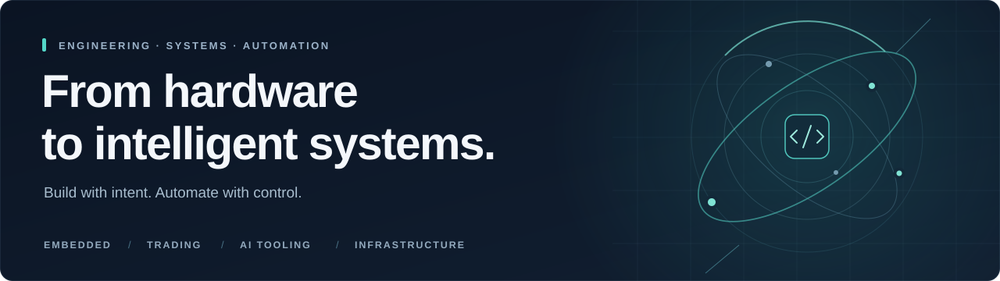

<h1 align="center">Farshid A. Barough</h1>

  <strong>Systems Engineer &nbsp;·&nbsp; Founder &amp; Owner of Artifaktory</strong> 
  Embedded &amp; Software &nbsp; / &nbsp; Algorithmic Trading &nbsp; / &nbsp; AI Tooling &amp; Automation

  Karlsruhe, Germany &nbsp;·&nbsp;
  <a href="https://artifaktory.de">Artifaktory</a> &nbsp;·&nbsp;
  <a href="#what-i-build">What I build</a> &nbsp;·&nbsp;
  <a href="#engineering-toolkit">Toolkit</a>

  

## Engineering across the whole system

I'm Farshid, a systems engineer with a background in **firmware, software development and safety-critical embedded systems**. My work now spans **algorithmic trading, AI tooling, automation, full-stack software and infrastructure**.

I work across the boundaries between these disciplines: turning requirements into architectures, connecting software with hardware, and building workflows that make complex systems easier to test, understand and operate. I'm interested in the whole system—not just the code that runs inside it.

## What I build

<table>
  <tr>
    <td width="50%" valign="top">
      <h3>01 &nbsp; Embedded &amp; systems</h3>
      
Firmware and hardware-facing software in <strong>C, C++ and Python</strong>, with an emphasis on clear interfaces, predictable behaviour, testing and system integration.

    </td>
    <td width="50%" valign="top">
      <h3>02 &nbsp; AI tooling &amp; automation</h3>
      
Coding-agent workflows, reusable tooling and development automation. I work with scoped tasks, isolated workspaces, automated checks, independent reviews and human approval for consequential changes.

    </td>
  </tr>
  <tr>
    <td width="50%" valign="top">
      <h3>03 &nbsp; Algorithmic trading</h3>
      
Event-driven trading systems spanning market data, market-regime analysis, backtesting, strategy optimisation, risk controls and execution monitoring.

    </td>
    <td width="50%" valign="top">
      <h3>04 &nbsp; Software &amp; integration</h3>
      
Backend services, APIs, web applications and operational dashboards. I connect application logic, data and user interfaces into modular, maintainable systems.

    </td>
  </tr>
  <tr>
    <td width="50%" valign="top">
      <h3>05 &nbsp; Infrastructure &amp; delivery</h3>
      
Linux environments, containers, self-hosted CI runners and deployment pipelines—with attention to reproducibility, monitoring, security and reliable day-to-day operation.

    </td>
    <td width="50%" valign="top">
      <h3>06 &nbsp; Hardware &amp; compute</h3>
      
Workstation and server planning, component selection and system integration. I consider compatibility, workloads, resource limits and the trade-off between local and cloud compute.

    </td>
  </tr>
</table>

## Artifaktory

**Independent engineering. From requirements to integration.**

I founded and run **Artifaktory**, an owner-operated engineering and IT business in Karlsruhe. I bring together **technical consulting, hardware selection and procurement, custom software, system integration and automation** around real operational needs.

My approach is to treat hardware, software, infrastructure and the working process as parts of one system. That means understanding the requirements, reusing suitable components, validating the design, and planning for documentation, handover and ongoing operation from the start.

## How I work

> **Automate the work. Keep the decisions accountable.**

I use AI to explore, implement and review—not to remove responsibility for the result. I favour explicit requirements, modular designs, reproducible environments and testable changes. For higher-risk work, independent review and human approval remain part of the process.

**Understand → Design → Build → Verify → Operate**

## Engineering toolkit

  
<strong>Languages, platforms and tools I work with</strong>

| Area | Tools & practices |
| :--- | :--- |
| Firmware & software | C · C++ · Python · TypeScript |
| Application engineering | FastAPI · Django · React · Next.js · PostgreSQL |
| Infrastructure | Linux · Docker · Docker Compose · GitHub Actions |
| AI-assisted development | Codex · GitHub Copilot · OpenCode |
| Quality engineering | pytest · Playwright · Static analysis · Architecture documentation |
| Workflow design | Task isolation · Automated checks · Independent reviews · Human approval gates |

**Currently exploring:** local coding models, portable agent configurations and multi-worker orchestration—with particular interest in privacy, reproducibility and compute efficiency.

---

  <strong>Good engineering connects the pieces—and makes the result understandable.</strong>  
  I welcome conversations about systems engineering, trading technology and practical AI automation. 
  <a href="https://artifaktory.de">Connect through Artifaktory</a>

